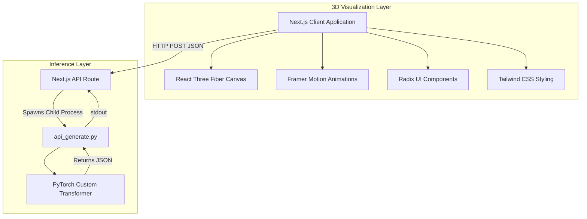

# Transformer Visualizer

A professional-grade, 3D-interactive educational platform designed to visualize the internal operations of a custom-built Transformer architecture.

## Overview

This project bridges the gap between deep learning mathematics and interactive data visualization. At its core lies a Transformer model implemented entirely from scratch in PyTorch, operating without the abstraction layers of high-level libraries. The frontend provides a stunning, hardware-accelerated 3D representation of the data flowing through the network, allowing users to inspect token embeddings, positional encodings, multi-head attention weights, and softmax logits in real-time.

## Key Features

- **Custom PyTorch Transformer**: A ground-up implementation of the original "Attention Is All You Need" architecture, ensuring complete transparency into the model's inner workings.
- **3D Pipeline Visualization**: Built with React Three Fiber, featuring interactive geometric stages that represent the tokenization, embedding, encoding, and decoding phases.
- **Real-time Attention Analysis**: Dynamic 2D heatmaps and 3D arc visualizations of multi-head attention weights, demonstrating how tokens relate to one another.
- **Vector Embeddings Inspector**: Interactive scatter plots representing high-dimensional token embeddings reduced to 2D space.
- **Logit Streaming**: Live typewriter-style streaming of generated output paired with detailed probability bar charts for the top-k token predictions.

## Architecture

The system utilizes a modern web stack communicating directly with a dedicated deep learning backend. 



## Backend Execution Flow

The Next.js backend operates as a bridging layer between the React frontend and the PyTorch inference scripts. When a generation request is received, the Node.js environment spawns a Python child process within a dedicated Conda environment (`torch_gpu`) to execute the generation loop and capture the raw tensor data for visualization.

```mermaid
sequenceDiagram
    participant User
    participant NextJS as Next.js API Route
    participant Node as Node Child Process
    participant PyTorch as Custom Transformer (Python)
    
    User->>NextJS: Submit Prompt
    NextJS->>Node: Spawn `conda run -n torch_gpu python api_generate.py`
    Node->>PyTorch: Execute Model Inference
    
    rect rgb(30, 40, 60)
        Note over PyTorch: Forward Pass Execution
        PyTorch-->>PyTorch: 1. Tokenize Input
        PyTorch-->>PyTorch: 2. Generate Embeddings & Positional Encodings
        PyTorch-->>PyTorch: 3. Compute Multi-Head Attention
        PyTorch-->>PyTorch: 4. Auto-regressive Generation
    end
    
    PyTorch->>Node: Serialize tensors & weights to JSON (stdout)
    Node->>NextJS: Parse JSON Output
    NextJS->>User: Stream Results & Visualization Data
```



## Setup and Installation

### Prerequisites
- Node.js 18+
- Python 3.10+
- Anaconda or Miniconda

### Backend Configuration
1. Create and activate the conda environment:
   ```bash
   conda create -n torch_gpu python=3.10
   conda activate torch_gpu
   ```
2. Install PyTorch and dependencies:
   ```bash
   conda install pytorch torchvision torchaudio pytorch-cuda=11.8 -c pytorch -c nvidia
   pip install transformers numpy
   ```

### Frontend Configuration
1. Install Node modules:
   ```bash
   npm install
   ```
2. Start the development server:
   ```bash
   npm run dev
   ```

### Usage
Navigate to `http://localhost:3000`. Enter a sequence in the input bar and click "Generate". Select any floating 3D stage in the pipeline to reveal its mathematical inner workings in the detail panel. Use the tabs to switch between the 3D pipeline, the Attention Heatmaps, the Embedding scatter plots, and the Generation probability views.

## Technical Stack

- **Deep Learning**: PyTorch, Python
- **Frontend Framework**: Next.js (App Router, Turbopack), React
- **3D Rendering**: Three.js, React Three Fiber, React Three Drei
- **UI & Animation**: Framer Motion, Tailwind CSS, Radix UI Primitives
